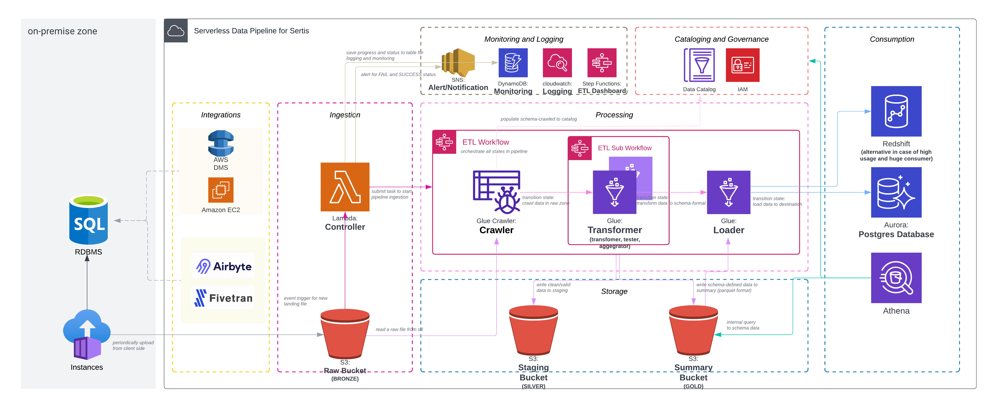

# Project: Sertis - Data Engineering Test

The proposal of data engineering project for Sertis - data engineer test

---

# TLDR: Conclusion

- **AWS**, is the underlying cloud platform for ETL pipeline in this project.
- All services designed to be **Serverless data pipeline to gain advantages over cost-optimization, scalability and
  rapid operation and less administration which operated and managed by cloud platform**
- **All components and infrastructure is created from Cloudformation template as IaC**.
- **Data Governance** can be used IAM **to control granularity of accessing data in any stages** which can create as
  group or role of user.
- **Daily Ingestion**, ingestion and updating is designed as "daily" first and can be modified in the future.
- **Scalability** will be grown and adjust dynamically cause Serverless nature and design.

---

# I: Architecture and Diagram

---

# II: Components

- **Integration Layer**
    - AWS services, DMS or EC2 with ingestion application can be used to transfer data from on-prem zone to the
      pipeline.
    - Client side, in case of security/permission, client can be transfer data to outside organization into the pipeline
      directly.
    - Alternatively, Airbyte or Fivetran can be used as middle integration service to transfer data from client to the
      pipeline
- **Storage Layer**
    - s3: landing-zone (bronze), staging-zone (silver) and final-zone (gold), to store raw -> clean/valid/transformed ->
      schema and consumption-ready data
- **Monitoring and Logging**
    - DynamoDB: used as a logging table, to save progress and status in any states in the pipeline.
    - Cloudwatch: served as main monitoring and logging service for overall components during pipeline running.
    - SNS: used to be notification center to notify/alert for success and failed of ingestion.
    - Step Function: is the workflow dashboard will be used to monitor running and overall status of workflow.
- **Processing Layer**
    - Lambda: the pipeline executor, responsibility to submit incoming/landing file to be ingested periodically, control
      transition states, save the progress to Dynamodb and send alert to sns for notification.
    - Glue: is main processor(s) for transforming, testing, aggregating and loading.
    - StepFunction: is main workflow orchestration of serving the pipeline.
- **Consumption Layer**
    - Aurora Postgres: is the main destination database.
    - Alternatively, Redshift for huge usage case. (Note: may move T:Transform to be ELT in some cases).
    - Athena (optional), in case of internal or adhoc query to use data in another proposed e.g. modeling, reports.
- **Catalog and Governance Layer**
    - Glue Data Catalog: used to be data catalog for accessing as metadata in any data stages.
    - IAM: used to control accessing and permission for all user who involve in the pipeline and data.
    - Athena workgroup can be used to control data accessing and querying internally. 

---

# III: Workflow and States Transition

Inside workflow composed of states which provide specific tasks to work with data. Main states can be divided into
three states as follows:

1. Crawler - crawl raw data from landing data file in raw bucket which trigger by **s3-event trigger to a Lambda** which
   act as main controller of data pipeline. Schema and tables will be populated to Data Catalog in order to use in
   downstream states.
2. Transform(s) - data will be transformed in order to verify the format, clean and aggregate those data to be match
   with predefined schema and business-ready form.
3. Load - clean and ready-to-use data in staging is going to read and final step load to destination databases.

* All processing unit, using **Glue** as main service to manipulate, process and load data.
* `SUCCESS` status will be sent as message via **SNS** to the team by email/channel for notification automatically.
* `FAIL` in any states, failed message will be sent to the team by email/channel with the halt reason in the given
  state.
* all `status` in `state` will also save to **DynamoDB** which define to be main logging table of monitoring the
  progress of running workflow.

---

# IV: Interface and UI

1. StepFunction is the dashboard to monitor overall running processes in the pipeline.
2. Cloudwatch is used to monitor and log of running processes in the pipeline.
3. DynamoDB is the summary table to track the progress and status of the pipeline.
4. Athena can be used to adhoc query and verify data in all stages.

---

# V: Plan and Discussion

1. Cost and Timeline of the project, in case of design and optimize architecture to fit the requirement.
2. Data volume, estimated ingested data for Glue-DPU adjustment which will be the majority of cost.
3. Policy or security to access/transfer client data from on-prem zone or strategy to transfer data between client and
   pipeline. 
4. Business rules for data manipulation which will design and define data quality checks, filtering criteria and also failure strategy for reprocessing and reproducibility.
5. Consumption schema which used in business proposed in order to design and perform T:Transform (
   transform,clean,aggregated). 
6. Data Governance, plan and strategy to define granularity of accessing data in any stages.
7. Notification channel and alert criteria to be sent. 
--- 

